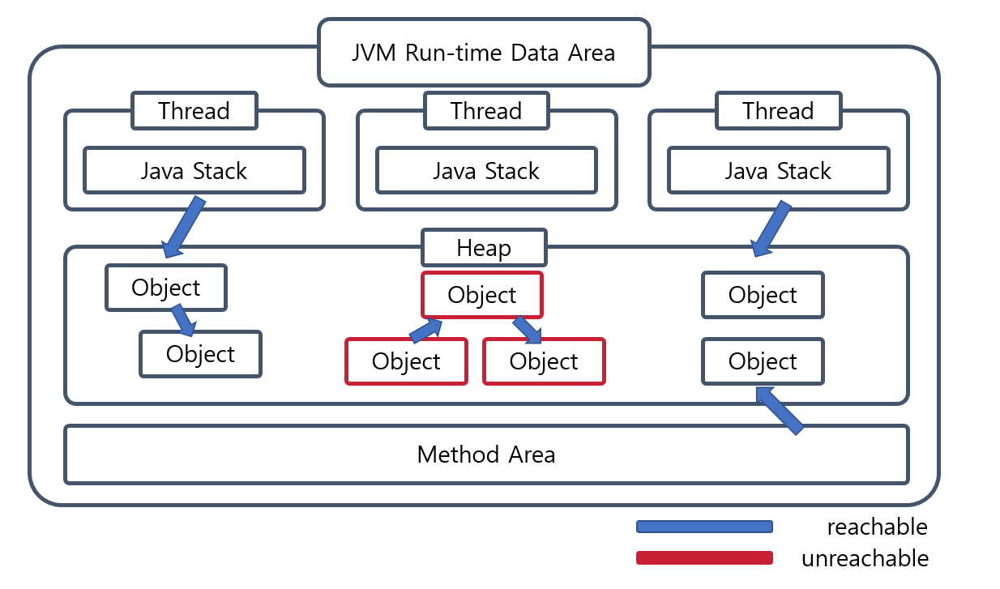
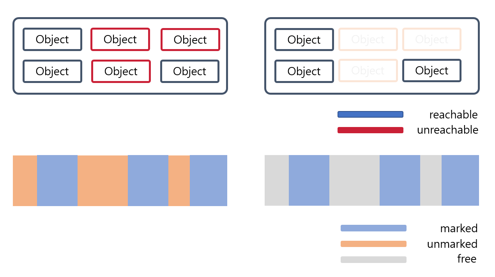
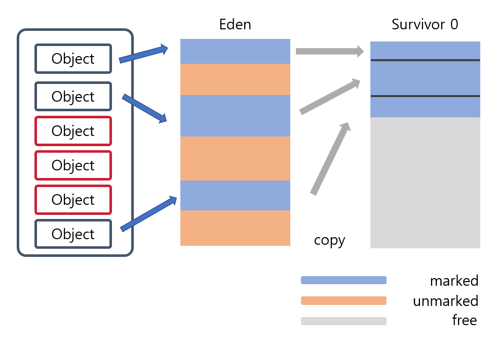

_Java_ 로 작성된 코드는 어떻게 돌아가는 걸까? 해당 물음에 답을 찾기 위한 _JVM_ 시리즈 4편, _JVM_ 의 구성요소 중 _GC_ 에 관한 글입니다.
이번 글에서는 _JVM_ 의 _GC_ 에 대한 기초 지식에 대해서 알아봅시다.

<!-- end -->

## _JVM_ 에서의 메모리 관리
지난 글에서는 _JVM_ 에서의 메모리가 어떻게 구성되는지 알아보았습니다.
_JVM_ 안에서 모두 공유되는 영역인 _Heap_ 부터 각각의 메소드의 작업별로 할당되는 _Stack_ 까지 다양한 영역이 존재합니다. 
프로그램을 실행하며 메소드에서 작업 진행 도중 새로운 데이터들이 메모리에 추가될 가능성이 높습니다. 
그렇다면 _Java_ 로 구성된 프로그램을 계속 작동시켜 놓으면 메모리가 계속 증가만 할까요? 
이 문제점에 해답을 주는 것이 바로 _Garbage Collection_ , _GC_ 입니다.

## _Garbage Collection_ 및 _Garbage Collection_ 의 대상
_Garbage Collection_ , _GC_ 는 _JVM_ 상에서 더 이상 사용되지 않는 데이터가 할당되어있는 메모리를 해제시켜주는 장치입니다.
_JVM_ 에서 자동으로 동작하기 때문에 _Java_ 는 특별한 경우가 아니면 메모리 관리를 개발자가 직접 해줄 필요가 없습니다.
_GC_ 가 주로 동작하는 대상은 _Heap_ 영역 내의 객체 중에서 참조되지 않은 데이터입니다.
예시로 코드와 함께 학습해보겠습니다.
```java
public class Main {
    public static void main(String[] args) {
        Person person = new Person("a", "곧 참조되지 않음");
        person = new Person("b", "참조가 유지됨");
        //GC 발생 가정 시점
    }
}

//Person은 "name"과 "description"을 필드로 가지며, 생성자에서 차례대로 주입받게 됨.

```
위에서 person은 처음에 "a" 라는 이름을 가진 객체를 참조하게 됩니다.
하지만 곧 이어 person이 "b" 를 참조하게 되며 "a"는 다음 줄에서 참조를 잃어버리게 됩니다.
_main_ 함수가 종료되기 직전, person이 가르키는 객체가 "b"를 가르킨 직후에 _GC_ 가 이루어진다고 가정해봅시다.
"b" 는 참조가 유지된 상태이기 때문에 _GC_ 의 대상이 아니지만, "a" 는 _GC_ 의 대상이 됩니다.
위의 경우처럼 참조하는 대상을 바꾸거나 메소드가 끝나서 _Stack_ 이 _pop_ 이 되면 참조되지 않는 객체들이 생겨납니다. <br>
참조되고 있는지에 대한 개념을 _reachability_ 라고 하고, 유효한 참조를 _reachable_ , 참조되지 않으면 _unreachable_ 이라고 합니다.
그리고 _GC_ 는 _unreachable_ 한 객체들을 _garbage_ 라고 인식하게 됩니다.
다음은 _Heap_ 영역에서 _reachable_ , _unreachable_ 한 개념들을 도식화하였습니다.



그림에서 보았던 것처럼 _Heap_ 영역 내부의 객체들은 _Method Area_ , _Stack_ , _Native Stack_ 에서 참조되면 _reachable_ 로 판정합니다.
이렇게 _reachable_ 로 인식되게 만들어주는 _JVM Runtime Area_ 들을 _root set_ 이라고 합니다.
또한 _reachable_ 이 참조하고 있는 다른 객체 역시 _reachable_ 이 됩니다.
하지만 _root set_ 의해 참조되고 있지 않은 객체들은 _unreachable_ 로 판정이 되어, _GC_ 의 대상이 됩니다.
예시 코드에서는 "a" 가 _unreachable_ , "b" 가 _reachable_ 상태입니다.
그래서 _unreachable_ 상태인 "a" 를 상대로 _GC_ 가 이루어집니다.

## Stop-The-World
 _GC_ 실행 알고리즘을 공부하기 전에 추가로 알아야 할 개념이 있습니다.
바로 _Stop-The-World_ 라는 개념입니다.
_JVM_ 은 _GC_ 를 통해 _JVM_ 에서의 여유 메모리를 확보할 수가 있습니다.
이 때문에 _GC_ 를 자주 실행시키면, 여유 메모리를 최대한 확보하여 성능이 좋아지리라 추측할 수도 있습니다.
하지만 빈번한 _GC_ 는 프로그램의 성능을 저하하게 됩니다.
_GC_ 가 일어나면 _GC_ 를 담당하는 쓰레드를 제외한 모든 쓰레드들은 작동이 일시적으로 정지되게 됩니다.
이를 _Stop-The-World_ 현상이라고 합니다. 
모든 쓰레드가 정지되기 때문에 더 이상 작업이 실행되지 않고, 성능이 저하됩니다.
그래서 적절한 빈도의 _GC_ 가 실행되도록 하여, _Stop-The-World_ 시간을 줄여 쓰레드가 정지되는 시간을 줄이는 것이 중요합니다.

## Algorithm
### _Weak Generational Hypothesis_
_GC_ 를 성공적으로 수행하는 _Algorithm_ 을 설계하기 위해서는 몇 가지 가설이 필요합니다.
그 중 대표적인 것이 _Weak Generational Hypothesis_ 입니다.
이 가설은 대부분의 객체는 빠르게 _unreachable_ 한 상태로 전환이 된다고 보고 있습니다.
또한, 저번 시간에 보았던 _Heap_ 의 메모리 영역 기준으로 오래된 영역에서 최신 영역으로의 참조 방향은 적게 존재한다고 가정합니다.


실제로 위의 가설의 경우 여러 관찰을 통해서 높은 경향성을 가지는 것으로 증명이 되었습니다.
[해당 링크](https://docs.oracle.com/javase/8/docs/technotes/guides/vm/gctuning/generations.html) 는 _Oracle_ 사의 _Java 8_ 에서 관찰 자료입니다.
대부분의 객체가 빠르게 소멸하는 것을 알 수가 있습니다.
이 가설을 바탕으로 하여, 가장 기본적인 알고리즘 두 개에 대해서 알아보도록 하겠습니다.

### Mark And Sweep Algorithm
가장 기본적인 알고리즘입니다. _root set_ 으로부터 출발하여, 참조되는 객체들에 대해서 마크를 하게 됩니다.
이 단계를 _Mark Phase_ 라고 합니다. 이후에는 마크되지 않은 객체들을 추적하여 삭제를 합니다.
삭제하는 단계를 _Sweep Phase_ 라고 합니다.



다음과 같이 메모리를 해제하는 것을 알 수가 있습니다. 하지만 그림에서도 볼 수 있다시피 메모리가 _Fragmentation_, 단편화되는 단점이 있습니다.
메모리에서의 단편화는 정렬되지 않은 조각으로 나뉘어져, 절대적인 크기는 충분하지만 추가적으로 메모리 할당이 되기 힘든 상태를 의미합니다. 
이를 해결하기 위한 것이 바로 _Mark And Compact Algorithm_ 입니다.

### Mark And Compact Algorithm
_Mark And Sweep Algorithm_ 처럼 참조되는 객체들에 대해서 마크를 하고, 참조되지 않으면 삭제를 합니다.
이후에 메모리를 정리하여, 메모리 단편화를 해결할 수 있도록 합니다.


많은 _GC_ 방식들이 이 _Algorithm_ 을 바탕으로 하여 구현되고 있습니다.

## _Major GC_ 와 _Minor GC_
위의 _Oracle_ 사에서 자료에서는 그래프에 _Minor Collections_ 와 _Major Collections_ 라는 단어가 나옵니다.
_GC_ 는 일어나는 시점에 따라서 크게 _Minor GC_ 그리고 _Major GC_ 로 나눌 수가 있습니다.
_Minor GC_ 는 _JVM_ 의 _Young_ 영역에서 일어나는 _GC_ 입니다.
_Young_ 에 위치한 각각의 영역이 가득 차게 되어 더 이상 새로운 객체를 생성할 수 없을 때 발생합니다.
실행 과정은 마크된 영역이 다음 영역으로 복사가 되면서 이루어집니다.



이 때, 마크가 된 영역만 복사되기 때문에 삭제 과정은 이루어지지 않습니다.
_Major GC_ 에 비해서 상대적으로 시간이 짧아서, _Stop-The-World_ 가 이루어지지 않는다고 알려져 있습니다.
실제로는 _Stop-The-World_ 가 이루어지며, _GC_ 를 담당하는 쓰레드를 제외하고 모든 쓰레드가 멈추게 됩니다.
하지만 이 시간이 무시가 가능할 정도로 짧게 이루어지기 때문에 _Stop-The-World_ 가 이루어지지 않는다고 간주하곤 합니다. <br>
이와 다르게 _Major GC_ 는 _Old_ 영역에서 이루어지게 됩니다. 
상당히 긴 시간 _Stop-The-World_ 가 이루어지며, 이는 _Java_ 프로그램에 영향을 줍니다.
이를 해결하기 위해서 _Major GC_ 에서 우리가 앞에서 다룬 _Mark And Compact Algorithm_ 을 기반한 여러 _GC_ 방식들이 선택 및 적용됩니다.

## 마치며
_JVM_ 의 메모리 영역, 그중에서도 _Heap_ 메모리를 정리해주는 _GC_ 의 기초에 대해서 살펴보게 되었습니다.
실제로 _GC_ 를 선택해서 사용할 때에는 _Java_ 프로그램 실행 시
```bash
java -XX:+UseParallelGC SampleProgram 
```
와 같이 _Serial GC_ , _Parallel GC_ 등 _GC_ 방식을 선택해서 사용할 수가 있습니다.
오늘 다룬 기초적인 지식을 바탕으로 하여, 각자의 _Java_ 프로그램에 맞는 _GC_ 방식을 채택하는게 좋습니다.

## Reference
- [Naver D2 Java Reference와 GC](https://d2.naver.com/helloworld/329631)
- [Oracle Java 8 - 3 generation](https://docs.oracle.com/javase/8/docs/technotes/guides/vm/gctuning/generations.html)
- [Plumbr Garbage Collection](https://plumbr.io/handbook/garbage-collection-in-java)
- [Dzone Minor GC vs Major GC vs Full GC](https://dzone.com/articles/minor-gc-vs-major-gc-vs-full)
