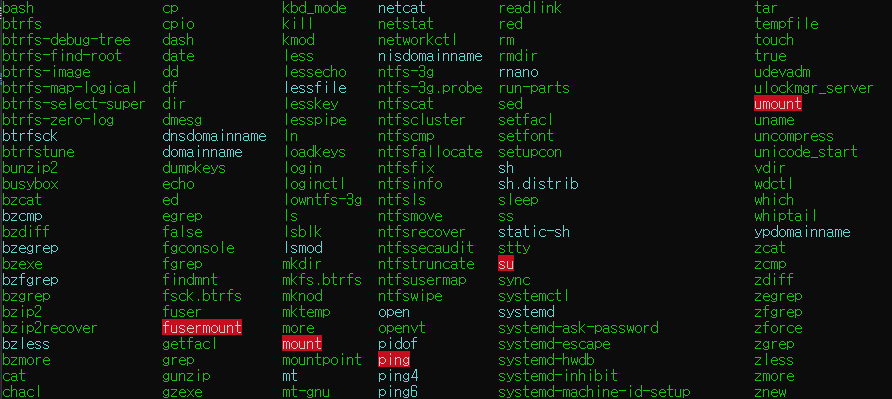
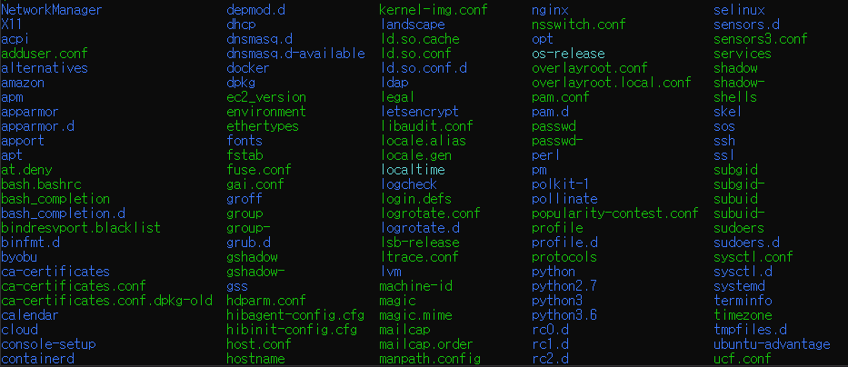

작성한 프로그램을 서버를 통해서 배포 시에 리눅스를 많이 사용합니다.
이 때, 리눅스를 잘 활용하기 위해서 리눅스의 각각의 경로(directory, 디렉터리)에 접근하여 작업할 때도 있습니다.
하지만 명령어를 따라치면서 어떤 의미를 가졌는지 쉽게 파악하기가 어렵습니다.
이를 이해하기 위한 리눅스 파일 시스템의 경로에 대해서 간단하게 훑어보는 리눅스 파일 시스템에 관한 글입니다.
<!-- end -->

## 배포할 때 만나는 케이스
우아한테크코스의 레벨 4가 마무리되며, 새로운 기능들을 추가하는 것보단 이전의 기능들을 안정감 있게 사용하는 것이 중요해졌습니다.
그래서 Java 코드를 새로 작성하는 것보다 인프라 관련 설정 및 이론을 공부하고 적용하는 비율이 상당히 높아졌습니다.
특히 서비스가 배포된 인스턴스의 리눅스 배포판인 우분투의 패키지 관리를 해주면서 해당 경로를 찾아가 기존의 필요없는 의존성 들을 직접 제거하게 되었습니다.

```bash
cd /etc/apt/
sudo vim source.list
```

이때, 한 크루가 해당 경로가 어떤 파일을 의미하는지를 질문하게 되었고, 우분투에서 저장소에 관한 주소 및 별칭을 관리하는 곳이라고 답변하였습니다.
일반적으로 사용하는 Windows나 MacOS에 비해서 상당히 다른 파일 경로 구조로 되어 있고 이것을 터미널로 작업을 해야 하기 때문에 쉽게 이해할 수가 없는 부분이기도 합니다.
우분투의 의존성을 관리하는 파일은 왜 하필 저 경로에 위치하게 되었는가? 를 비롯한 이해하기 위한 지식을 알기 위해 이 글을 쓰게 되었습니다.

## 최상위 경로와 사용자 경로
먼저 우분투에서는 최상위 권한(“root”) 및 사용자를 분리하여 사용하고 있습니다.
그래서 일반 사용자가 사용하는 경로와 최상위 권한을 가진 경로가 분리되어 있습니다.
먼저 AWS의 EC2에 접속하게 된다면 일반 사용자가 사용하는 경로로 이동하게 됩니다.
해당 명령어를 입력하면 다음과 같은 결과가 나오게 됩니다.

```bash
// CLI 명령
pwd
```
<br>

```bash
$ pwd
/home/ubuntu
$ ls 
2021-see-you-there  amazon-cloudwatch-agent.deb  goodday  repo      script.sh                                           
Dockerfile          awslogs-agent-setup.py       log      scenario  target 
```

일반적으로 작성한 프로그램을 배포하면 자동으로 이 경로에 파일을 옮기게 되며, 실행도 이곳에서 이루어집니다.
위의 결과에서도 저희 팀이 배포를 위해 사용한 파일들이 있는 경로와 스크립트 파일이 보입니다.
하지만 작성한 프로그램을 작동시키기 위한 Java 같은 언어와 MySQL과 같은 인프라는 어디서 설치되는지는 아직 궁금증이 해결되지 않았습니다.
윈도우의 경우에는 C 드라이브의 Program Files에 설치되어있습니다.
하지만 리눅스의 현재 경로에서는 해당 설정을 한 경로들이 존재하지 않습니다.
이를 확인하기 위해서 우리는 경로 중 가장 위에 있는 최상위 경로로 이동해주어야 합니다.

```bash
// CLI 명령
cd /
pwd
```
<br>

```bash
// 결과물
bin   dev  home initrd.img.old  lib64
media  opt   root  sbin  srv  tmp  var
vmlinuz.old  boot  etc  initrd.img  lib
lost+found  mnt    proc  run   snap  sys
usr  vmlinuz 
```

이전의 사용자가 정의한 프로그램과 폴더들이 있던 것과 달리 시스템 관련 상당히 많은 경로가 보입니다.
각각의 경로는 리눅스에서 중요한 의미가 있으며 대표적인 것들을 간략하게 알아가 보도록 하겠습니다.

## 각각의 디렉토리에 대한 정리
### bin
bin 경로는 실행 가능한 binary 파일들을 모아둔 장소입니다. 
이 binary 파일들은 시스템과 사용자들을 위한 명령어들을 모아놓았습니다. 
일반적으로 shell script에서 사용하는 “touch” , “echo”, “mkdir” 과 같은 명령어들이 이곳에서 정의되어 사용되고 있습니다.
아래는 해당 경로에 존재하는 폴더들의 캡쳐본입니다. CLI에서 사용하는 많은 명령어들을 볼 수가 있습니다.


<br>

### boot
부트 로더와 관련된 부분 설정들이 포함되어 있습니다. 
부팅을 할 때 필요한 이미지와 정보들이 들어있습니다. 
해당 인스턴스는 AWS에서 관리되어 관련 설정들이 포함되어 있습니다.
아래는 해당 경로에서 존재하는 폴더 및 파일들의 캡쳐본입니다.


<br>

### etc
현재 인스턴스 혹은 기기에서 사용되고 있는 프로그램들의 환경 설정들이 포함되어 있습니다.
작성한 프로그램을 사용할 때 수정할 수 있는 java 나 python에 관한 설정뿐만이 아니라 nginx와 같은 인프라 관련 프로그램
그리고 ssh와 같은 시스템 관련 설정까지 여기서 관리됩니다.
아래는 etc에서 존재하는 폴더 및 파일들의 캡쳐본입니다.



실제로 nginx을 환경을 수정한다는 것은 위의 etc 조건에 들어맞기 때문에 해당 경로에서 수정할 수 있습니다.
명령어를 관찰하면 해당 경로가 존재하는 것을 확인할 수가 있습니다.

```bash
vim /etc/nginx/nginx.conf
```
<br>

### home
각각의 사용자들을 위한 경로입니다. 
처음 도입부에서 본 것처럼 리눅스 입장에서 일반 사용자들이 사용하는 파일들을 모아두게 됩니다.
home 경로 밑에는 해당 리눅스를 사용하는 사용자들 목록이 보이게 됩니다.
현재 AWS에서는 ubuntu라는 사용자만 존재함으로 하나의 사용자 경로만 존재합니다.

```bash
// home 경로에서 ls 결과
ubuntu
```
<br>

### mnt
mnt는 mount의 약자 뜻을 가진 경로입니다.
리눅스 프로그램에 기기의 탈부착으로 임시로 연결된 경로가 생기면 해당 경로에서 확인할 수가 있습니다.
현재 프로젝트의 AWS에는 연결된 외부 장치나 시스템이 없으므로 아무런 경로가 나오지 않습니다.
하지만 시스템의 용량을 확장할 때나 WSL에서 윈도우 시스템을 인식할 때 해당 경로로 인식할 수가 있습니다.

```bash
//WSL에서의 윈도우 인식
///mnt 경로
c d wsl
```

np여기서 C는 Windows에서의 C 드라이브를 의미합니다.
<br>

### root
최상위 권한을 가진 사용자를 위한 경로입니다.
최상위 경로와는 이름이 같지만 다른 엄연히 다른 의미가 있습니다.
오직 최상위 권한을 가지고 이 경로에 있는 파일들을 수정할 수가 있습니다.
그래서 'cd root' 라는 명령어로 접근하려 하면 다음과 같은 접근 거부가 나오게 됩니다.
```bash
-bash: cd: root/: Permission denied
```
<br>

### usr
사용자가 이용하는 binary 파일, 라이브러리, 소스 코드 등이 포함되어 있는 경로입니다.
가장 최상위 경로인 / 에서 하위 경로를 바라보는 것과 비슷하게 usr 하위에도 각각의 역할에 맞게 경로들이 분리되어 있습니다.
/bin, /lib 등은 최상위 경로에서의 경로들이 가지는 의미를 /usr 경로 밑에서도 가지게 됩니다.
이외에도 직접적으로 소스에서 설치된 프로그램을 관리하는 /usr/local도 이곳에 존재합니다.

```bash
bin  config  games  include  lib  
libexec  local  sbin  share  src 
```

실제로 필자의 이전 글인 [JVM에 관하여 - Part 2. ClassLoader](https://tecoble.techcourse.co.kr/post/2021-07-15-jvm-classloader/) 에서도 최상위의 /lib가 아닌 해당 경로의 /usr/lib 에서 자바 관련 파일들을 확인하기도 하였습니다.

<br>

### var
리눅스 시스템 사용 중에 발생한 로그 및 데이터들이 저장되는 경로입니다.
쌓이는 데이터의 성격에 따라 /log, /tmp, /cache 등이 있으며 로그에 대한 경로를 설정해두지 않으면 리눅스 단에서의 로그는 이곳에 쌓이게 됩니다.

```bash
awslogs  backups  cache  crash  lib  local  lock
log  mail  opt  run  snap  spool  tmp  www 
```

앞에서 설명한 nginx의 환경 설정은 /etc로 들어가서 확인하게 되지만, 로그는 /var에 저장되기 때문에 해당 명령어를 통해서 로그에 접근합니다.

```bash
cd /var/log/nginx
```

## 마치며
지금까지 리눅스 파일 시스템에서의 각각의 경로를 확인해보고 어떤 의미를 가졌는지를 알아보았습니다.
이외에도 /proc, /run 등 중요한 의미가 있는 경로들도 존재합니다.
하지만 이 모든 경로의 의미를 알고 있어도 배포 중 필요한 설정들이 어디 있는지 확인하기는 매우 어렵습니다.
다만 리눅스 파일 시스템 기반 지식을 바탕으로 설정을 수정해주기 위해 해당 경로에 접근할 때, 무엇을 수정하는지 큰 틀을 파악할 수가 있습니다.
단순히 구조를 외우는 것이 아닌, 큰 의미를 파악하는 데 있어서 많은 도움이 되길 바랍니다.

## Reference
- [The Geek Stuff - Linux Directory Structure (File System Structure) Explained With Examples](https://www.thegeekstuff.com/2010/09/linux-file-system-structure/)
