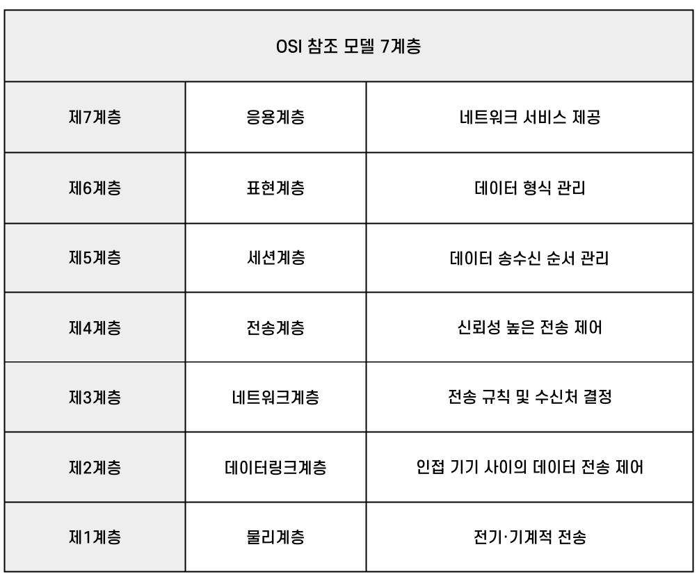
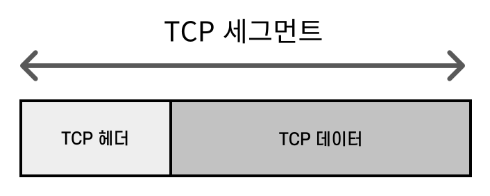
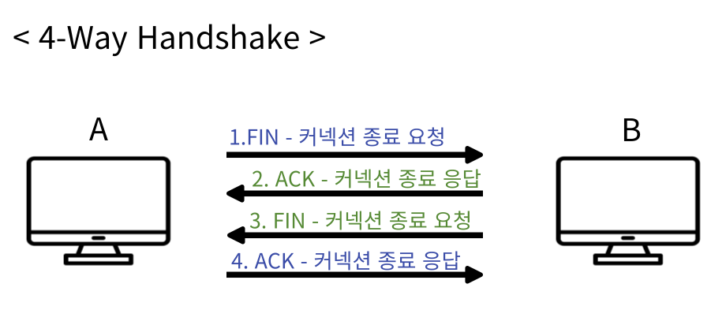
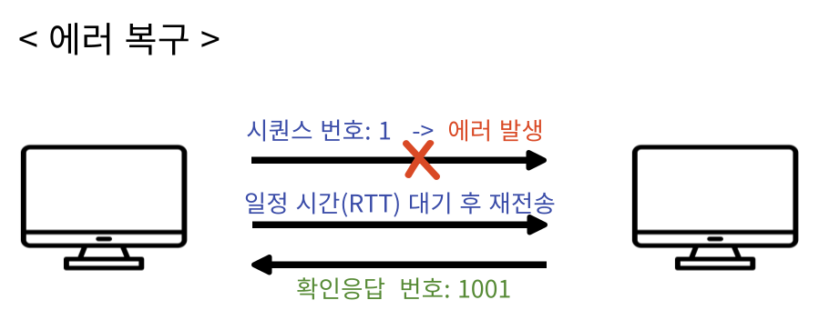
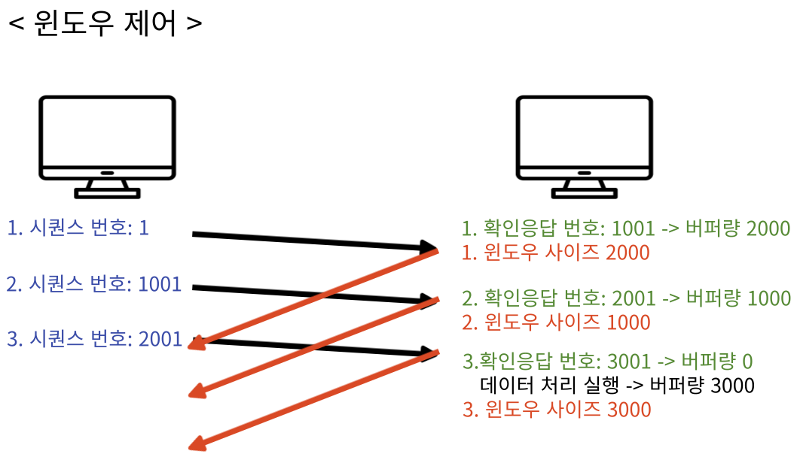

## OSI 7계층과 전송제어 프로토콜

데이터 통신은 여러 단계로 진행되는데, OSI 참조 모델은 그 과정을 7개 계층으로 나눈다. 1계층(물리 계층)은 ‘케이블이 연결된 상대에 대한 전기·기계적 신호 전달’ 제어를 담당한다. 2계층(데이터링크 계층)은 네트워크 내부에서 데이터를 주고받는 방식을, 3계층(네트워크 계층) 네트워크 간에 데이터 송수신 방식을 제어한다. 즉, 하나의 컴퓨터에서 다른 컴퓨터로 데이터를 주고받는 방식을 결정하는 일이 1계층부터 3계층의 역할이다.

   
3계층 이하에서는 ‘데이터 전달’만 제어할 뿐, 신뢰할 수 있는 데이터 전달을 보장하지 못한다. 데이터를 수신할 대상이 존재하지 않거나, 전송 중인 데이터가 분실·손상되는 문제를 다루지 않는다. 따라서 데이터를 안전하게 전송하기 위하여 전달되기 전과, 전달된 후의 데이터에 대한 처리를 4계층(전송계층)이 제어한다. 이러한 처리를 담당하는 프로토콜이 전송제어프로토콜 (TCP, Transmission Control Protocol)이다. 그렇다면 TCP는 안전한 데이터 전송을 위해 구체적으로 어떤 역할을 담당할까?

## TCP 헤더와 포트 번호

물건이 상자에 포장되어 택배로 보내지듯이, 데이터도 송신에 필요한 제어 정보와 함께 전송된다. 데이터의 앞부분에 위치하는 제어 정보를 헤더(Header)라고 한다. 데이터가 안전하게 전달되도록 제어하는 역할을 TCP 헤더가 담당한다.

위 사진은 TCP 헤더가 제어하는 정보를 나타낸다. 우선 TCP 헤더에는 송신처와 수신처의 포트 번호가 포함된다. 앞서 편의상 컴퓨터 간에 데이터를 주고받는다고 설명했지만, 실제로 데이터를 주고받는 주체는 애플리케이션이다. 컴퓨터 내 존재하는 다양한 애플리케이션 중 데이터 송수신이 필요한 애플리케이션을 구분하기 위해 포트 번호를 지정한다.

## 세그먼트 분할과 시퀀스 번호

데이터와 헤더가 통합된 상태를 프로토콜 데이터 유닛(PDU, Protocol Data Unit)이라고 한다. 3계층 애플리케이션으로부터 받은 데이터(메시지)에 4계층의 전송 제어 헤더를 결합한 것이 4계층 PUD 즉, 세그먼트이다.

하나의 데이터는 여러 개의 세그먼트로 분할되어 전송된다. 각각의 세그먼트에 번호를 부여하는데 이것을 ‘시퀀스 번호’라고 한다. 여러 개로 분할 전송된 데이터가 최종적으로 순서에 맞게 결합하여 수신되는 만큼 시퀀스 번호는 중요한 의미를 가진다.

## 커넥션과 3-way handshake

수신처 IP주소로 데이터를 전송했지만, 실제 수신처가 존재하지 않을 경우 데이터 전송에 실패할 것이다. 또 수신처가 존재하지만, 데이터를 받을 준비가 되지 않은 경우도 마찬가지다. 본격적으로 데이터를 주고받기 전, 송신자와 수신자 간 데이터 전송 가능 여부를 확인한다면 데이터의 전송을 보장할 수 있다. 이처럼 송·수신자 간에 데이터를 확실하게 주고받을 수 있는 가상 경로를 ‘커넥션’이라고 한다.

커넥션을 확보하는 방법으로 쓰리웨이 핸드쉐이크(3-Way Handshake)가 있다. 위 그림처럼 애플리케이션 A는 B에 데이터 송신 허가를 요청(SYN)한다. B는 요청에 대한 허가(ACK)를 A에 알린다. 이로써 A는 B에 대한 송신로를 확보한다.

하지만 아직 반대의 송신로(B → A)는 확보되지 못한 상황이다. 따라서 B는 A에 허가 사실(ACK)을 전달함과 동시에 데이터 송신 허가 요청(SYN)을 함께 보낸다. A가 B의 요청을 수락(ACK)함으로써 양방향 커넥션이 확립된다. 연결 설정에 사용되는 제어 비트인 SYN과, 데이터 수신 성공을 의미하는 ACK 같은 플래그 정보는 TCP 헤더에 명시된다.

## 에러 복구와 확인 응답

데이터가 전송 도중에 분실되는 경우가 발생할 수 있다. 만약 수신처에서 데이터를 받았다는 응답을 보내준다면 송신처는 분실 여부를 확인할 수 있다. 이처럼 세그먼트를 수신하면, 응답 정보를 송신처에 전달하는데 이를 ‘확인응답’이라고 한다.

TCP 헤더에 시퀀스 번호와 확인응답 번호가 포함되는데, 앞서 설명했듯이 시퀀스 번호는 세그먼트의 순서를 나타낸다. 확인응답 번호는 다음에 받고자 하는 데이터의 시퀀스 번호를 의미한다. 수신처는 세그먼트의 시퀀스 번호를 통해 해당 데이터의 순서를 파악하고, 다음에 받을 시퀀스 번호를 확인응답 번호에 명시하여 응답한다.

세그먼트 송신 후 일정 기간 확인 응답이 돌아오지 않는다면 송신처는 해당 세그먼트를 재전송한다. 송신처가 확인 응답을 기다리는 시간을 RTT(Round Trip Time)라고 한다. RTT의 초깃값은 3초로 설정되는데, 실제 확인응답이 돌아오는 시간을 반영하여 RTT는 조정된다.

## 윈도우 제어

하나의 세그먼트를 송신하고 확인 응답을 보내는 과정이 시간 비용면에서 비효율적일 수 있다. 한 개의 세그먼트에 관한 확인 응답을 받기까지 다음 세그먼트를 보내지 못하고 기다려야 하기 때문이다. 따라서 복수의 세그먼트를 한 번에 전송하고 확인응답을 받는 방식을 통해 시간 효율을 높일 수 있다.

복수의 세그먼트를 정확하고 효율적으로 송신하기 위해 ‘윈도우 제어’를 사용한다. ‘윈도우 제어’는 송신자와 수신자 간 데이터 전송 속도를 조절하는 ‘흐름 제어(Flow Control)’의 한 형태다. 복수의 세그먼트를 안정적으로 처리하기 위해 수신한 데이터를 일시적으로 보관하는 버퍼(Buffer)가 필요하다. 수신처의 버퍼 용량 이상으로 데이터가 송신된다면, 데이터를 처리할 수 없어서 파기하는 ‘오버플로’가 발생할 수 있다. 따라서 데이터 수신처는 어느 정도 버퍼량을 가졌는지 상대방에게 알려주게 된다.

위 그림에서 송신처는 한 번에 3개의 세그먼트를 전송한다. 각각의 세그먼트에 대한 확인 응답을 보낼 때 버퍼 용량에 해당하는 윈도우 사이즈를 TCP 헤더에 포함한다. 따라서 송신처는 수신처의 윈도우 사이즈에 맞는 용량의 데이터를 전송할 수 있다. 이처럼 윈도우 사이즈로 버퍼량을 전달하여 수용 가능한 데이터를 송수신하는 과정을 윈도우 제어라고 한다.

## TCP의 단점과 UDP

앞서 설명한 TCP의 역할인 쓰리웨이 핸드쉐이크, 에러 복구, 흐름 제어 방식은 데이터 전송을 확실하게 보장한다는 장점이 있다. 하지만 안정적인 데이터 전송을 위한 확인 요청과 응답 과정에서 시간이 소모된다는 단점이 있다. UDP를 통하여 이러한 단점을 보완할 수 있다.

위 그림은 UDP 헤더를 나타낸다. TCP 헤더에 포함됐던 확인 응답 번호, 시퀀스 번호, 윈도우 사이즈, 제어 비트, 등이 빠져 있음을 알 수 있다. 데이터의 확실한 전송을 보장하기 위한 절차가 UDP에는 생략된 것이다. 이처럼 UDP는 TCP만큼 데이터의 안정적인 전송을 보장할 수 없지만, 그만큼 시간 효율이 높아지는 장점이 있다.

이처럼 ‘빠른 전송’이 필요한 경우 UDP를, ‘정확한 전송’이 필요한 경우에는 TCP를 사용할 수 있다. 각각의 장단점을 제대로 파악하여 서비스 환경에 맞는 프로토콜을 선택할 필요가 있을 것이다.

## 참고
- [위키피디아](https://en.wikipedia.org/wiki/Transmission_Control_Protocol)
- [정보통신 기술 용어 해설](http://www.ktword.co.kr/test/view/view.php?m_temp1=1889)
- [3-way handshake](https://www.tutorialspoint.com/tcp-3-way-handshake-process)
- [tcp window](https://accedian.com/blog/tcp-receive-window-everything-need-know/)
- '성공과 실패를 결정하는 1%의 네트워크 원리' / Tsutomu Tone / 성안당
- '하루 3분 네트워크 교실'/ 아미노 에이지 / 영진닷컴
